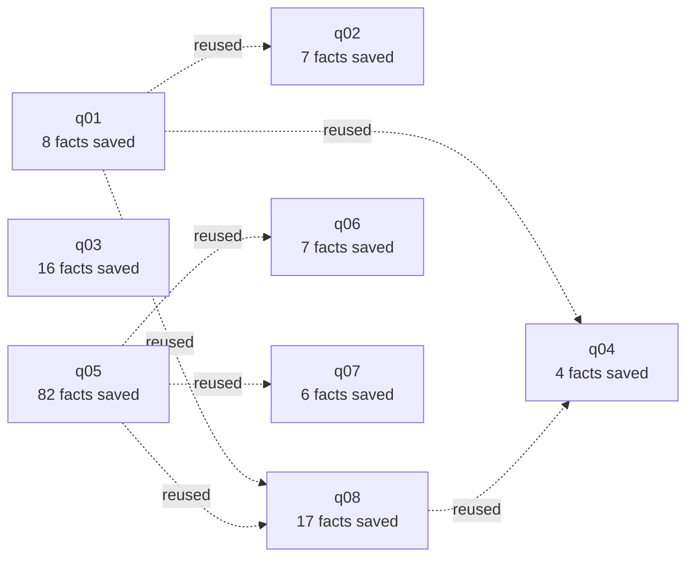

# Run overview

## Cost and audit trend across questions

| Question | Difficulty | Known facts reused | Total cost | Audit verdicts |
|---|---|---|---|---|
| q01 | 1 | 0 | $0.3330 | ⚠️2 ❔4 |
| q02 | 1 | 5 | $0.4157 | ⚠️4 ⭕3 ❔1 |
| q03 | 2 | 0 | $1.1912 | ⚠️3 ⭕6 ❔5 |
| q04 | 2 | 5 | $0.1936 | ⚠️2 ❔2 |
| q05 | 3 | 0 | $0.7335 | ⚠️5 ⭕8 ❔3 |
| q06 | 3 | 3 | $0.3710 | ✅1 ⚠️3 ⭕2 |
| q07 | 4 | 3 | $0.1941 | ⭕1 ❔4 |
| q08 | None | 9 | $1.0679 | ⚠️5 ⭕3 ❔1 |

## Memory reuse across questions

