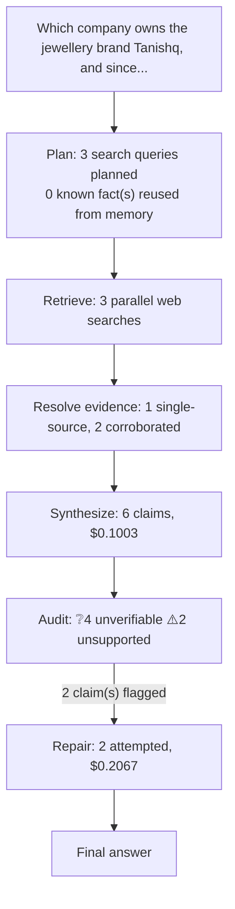

# q01: Which company owns the jewellery brand Tanishq, and since when has it been part of that company?

## Answer

Tanishq is owned by Titan Company Limited, and its beginnings under Titan date to 1994. However, 1996 is the better-supported year for its jewellery-brand launch, with Titan’s investor presentation distinguishing the 1994 jewellery-facility inauguration from the 1996 Tanishq milestone. Titan’s official sources disagree on the launch date: its franchising page says 1994, while its heritage timeline and Q3 FY2020 earnings-call transcript say Tanishq was launched in 1996.

Original answer before repair

Tanishq is owned by Titan Company Limited, and its beginnings under Titan date to 1994. However, 1996 is the better-supported year for its launch as a jewellery brand. Titan’s official sources disagree on the launch date: its franchising page says 1994, while its heritage timeline and an earnings-call transcript say 1996.

## Evidence

| Verdict | Claim | Citation | Quote | Reasoning |
|---|---|---|---|---|
| ❔ unverifiable | Tanishq is owned by Titan Company Limited. | [link](https://www.titancompany.in/business-division/jewellery-division) | — | Cited page returned HTTP 200 but no extractable body text (commonly a JavaScript-rendered page whose content isn't in the server-sent HTML) -- could not verify against it. |
| ❔ unverifiable | Tanishq’s beginnings under Titan date to 1994. | [link](https://www.titancompany.in/business-division/jewellery-division) | — | Cited page returned HTTP 200 but no extractable body text (commonly a JavaScript-rendered page whose content isn't in the server-sent HTML) -- could not verify against it. |
| ⚠️ unsupported | 1996 is the better-supported year for Tanishq’s jewellery-brand launch, with Titan’s investor presentation distinguishing the 1994 jewellery-facility inauguration from the 1996 Tanishq milestone. | [link](https://www.titancompany.in/sites/default/files/2026-02/SEinvestorpresentationQ32025-26.pdf) | — | The chunks contain unreadable PDF streams and structural metadata, not readable statements about Tanishq’s launch or the jewellery-facility inauguration. The visible numbers 1994 and 1996 are PDF obje |
| ❔ unverifiable | Titan’s franchising page gives 1994 as Tanishq’s launch year, conflicting with its other official accounts. | [link](https://www.titancompany.in/business-opportunities/franchising) | — | Cited page returned HTTP 200 but no extractable body text (commonly a JavaScript-rendered page whose content isn't in the server-sent HTML) -- could not verify against it. |
| ❔ unverifiable | Titan’s heritage timeline dates the Tanishq jewellery launch to 1996. | [link](https://www.titancompany.in/our-heritage) | — | Cited page returned HTTP 200 but no extractable body text (commonly a JavaScript-rendered page whose content isn't in the server-sent HTML) -- could not verify against it. |
| ⚠️ unsupported | Titan’s Q3 FY2020 earnings-call transcript says Tanishq was launched in 1996. | [link](https://www.titancompany.in/sites/default/files/2023-08/Q3%2520FY20%2520Earnings%2520Call%2520Transcript.pdf) | — | The evidence chunks contain garbled PDF data rather than readable transcript text. They neither confirm that Tanishq was launched in 1996 nor state a conflicting launch year. |

## Repair attempts

- **confirmed** (was `unsupported`): "1996 is the better-supported year for Tanishq’s jewellery-brand launch, with Titan’s investor presentation distinguishing the 1994 jewellery-facility inauguration from the 1996 Tanishq milestone." -> "1996 is the better-supported year for Tanishq’s jewellery-brand launch, with Titan’s investor presentation distinguishing the 1994 jewellery-facility inauguration from the 1996 Tanishq milestone." ([source](https://www.titancompany.in/sites/default/files/2024-05/Q4FY24%20Earnings%20Presentation.pdf))
- **confirmed** (was `unsupported`): "Titan’s Q3 FY2020 earnings-call transcript says Tanishq was launched in 1996." -> "Titan’s Q3 FY2020 earnings-call transcript says Tanishq was launched in 1996." ([source](https://www.titancompany.in/sites/default/files/2023-08/Q3%20FY20%20Earnings%20Call%20Transcript.pdf))

## Cost

- Analyst: $0.1003
- Audit: $0.0260
- Repair: $0.2067
- **Total: $0.3330**
