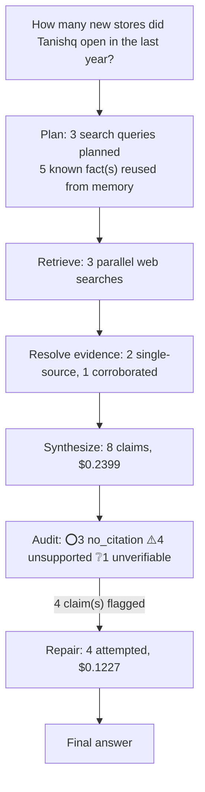

# q02: How many new stores did Tanishq open in the last year?

## Answer

If “last year” means FY2025–26, Tanishq added 27 stores net in India, calculated from quarterly additions of 3, 6, 10 and 8. These figures come from a single company source—Titan’s quarterly disclosures. I could not find a full-year worldwide total of new Tanishq store openings in the supplied evidence.

Original answer before repair

If “last year” means FY2025–26, Tanishq added 27 stores net in India, calculated from quarterly additions of 3, 6, 10 and 8. These figures come from a single company source—Titan’s quarterly disclosures—and measure net additions, not gross new-store openings. I could not find a full-year worldwide total of new Tanishq store openings in the supplied evidence.

## Evidence

| Verdict | Claim | Citation | Quote | Reasoning |
|---|---|---|---|---|
| ⭕ no_citation | Tanishq added 27 stores net in India in FY2025–26, calculated by summing the four quarterly figures. | — | — | Claim carries no citation to verify against. |
| ⚠️ unsupported | Tanishq added 3 stores net in India in Q1 FY2025–26. | [link](https://www.titancompany.in/sites/default/files/2025-07/Q1FY26%20-%20Quaterly%20Update%20%28Uploaded%29.pdf) | — | The provided evidence chunks are garbled and contain no readable statement about Tanishq’s net store additions in India in Q1 FY2025–26. They neither confirm nor contradict the claim. |
| ⚠️ unsupported | Tanishq added 6 stores net in India in Q2 FY2025–26. | [link](https://www.titancompany.in/sites/default/files/2025-10/Q2FY26%20-%20Quarterly%20Update%20_Uploaded.pdf) | — | The evidence chunks contain garbled, unreadable PDF data and no relevant statement about Tanishq's net store additions in India in Q2 FY2025–26. They neither confirm nor contradict the claim of 6 net  |
| ⚠️ unsupported | Tanishq added 10 stores net in India in Q3 FY2025–26. | [link](https://www.titancompany.in/sites/default/files/2026-01/Quarterly%2520Update%2520-%2520Q3FY26%2520-%2520SE%2520Uploaded.pdf) | — | The evidence chunks contain garbled PDF data and no readable statement about Tanishq's net store additions in India in Q3 FY2025–26. They neither confirm nor contradict the claim of 10 net additions. |
| ❔ unverifiable | Tanishq added 8 stores net in India in Q4 FY2025–26. | [link](https://www.titancompany.in/news/titan-FY26-results) | — | Cited page returned HTTP 200 but no extractable body text (commonly a JavaScript-rendered page whose content isn't in the server-sent HTML) -- could not verify against it. |
| ⭕ no_citation | The quarterly figures come from a single company source, Titan’s disclosures. | — | — | Claim carries no citation to verify against. |
| ⚠️ unsupported | The reported additions measure net additions rather than gross new-store openings. | [link](https://www.titancompany.in/sites/default/files/2026-05/Q4FY26%20-%20Financial%20results%20Uploaded.pdf) | — | The evidence chunks are garbled and contain no readable statement defining the reported additions as net additions rather than gross new-store openings. They neither confirm nor contradict the claim. |
| ⭕ no_citation | The supplied evidence does not establish a full-year worldwide total of new Tanishq store openings. | — | — | Claim carries no citation to verify against. |

## Repair attempts

- **confirmed** (was `unsupported`): "Tanishq added 3 stores net in India in Q1 FY2025–26." -> "Tanishq added 3 stores net in India in Q1 FY2025–26." ([source](https://www.titancompany.in/sites/default/files/2025-07/Q1FY26%20-%20Quaterly%20Update%20%28Uploaded%29.pdf))
- **confirmed** (was `unsupported`): "Tanishq added 6 stores net in India in Q2 FY2025–26." -> "Tanishq added 6 stores net in India in Q2 FY2025–26." ([source](https://www.titancompany.in/sites/default/files/2025-10/Q2FY26%20-%20Quarterly%20Update%20_Uploaded.pdf))
- **confirmed** (was `unsupported`): "Tanishq added 10 stores net in India in Q3 FY2025–26." -> "Tanishq added 10 stores net in India in Q3 FY2025–26." ([source](https://nsearchives.nseindia.com/corporate/TITAN003_06012026203710_IntimationQ3FY26updatesigned.pdf))
- **unresolvable** (was `unsupported`): "The reported additions measure net additions rather than gross new-store openings." -> "The reported additions measure net additions rather than gross new-store openings."

## Cost

- Analyst: $0.2399
- Audit: $0.0531
- Repair: $0.1227
- **Total: $0.4157**
