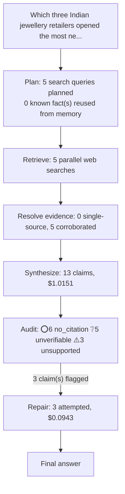

# q03: Which three Indian jewellery retailers opened the most new stores in the last two years, and what is your evidence for each?

## Answer

I could not find a definitive ranking of actual new-store openings for September 14, 2024–September 14, 2026: the supplied evidence lacks comparable, complete gross-opening totals. Titan, Kalyan Jewellers and Malabar Gold & Diamonds are the strongest supported candidates among the retailers reviewed, based on reported network expansion rather than a verified openings ranking. Titan’s domestic jewellery network increased from 991 stores on September 30, 2024 to 1,227 on June 30, 2026—236 net additions. Kalyan Jewellers’ group network increased from 303 showrooms on September 30, 2024—231 Kalyan showrooms in India, 36 Kalyan showrooms in the Middle East and 36 Candere showrooms—to 524, including Candere and overseas locations, on June 30, 2026—221 net additions. For Malabar, India Ratings provides a clearer India-only comparison: 208 stores at the FY2023–24 baseline, 251 in FY2024–25 and 280 by March 25, 2026—72 net additions across that approximately two-year period. These figures have different geographic and brand coverage, and Malabar’s comparison uses different dates, so they should not be presented as an apples-to-apples ranking of new stores opened.

Original answer before repair

I could not find a definitive ranking of actual new-store openings for September 14, 2024–September 14, 2026: the supplied evidence lacks comparable, complete gross-opening totals. Titan, Kalyan Jewellers and Malabar Gold & Diamonds are the strongest supported candidates among the retailers reviewed, based on reported network expansion rather than a verified openings ranking. Titan’s domestic jewellery network increased from 991 stores on September 30, 2024 to 1,227 on June 30, 2026—236 net additions. Kalyan’s group network, including Candere and overseas showrooms, increased from 303 to 524 over those same dates—221 net additions. For Malabar, India Ratings provides a clearer India-only comparison: 208 stores at the FY2023–24 baseline, 251 in FY2024–25 and 280 by March 25, 2026—72 net additions across that approximately two-year period. These figures have different geographic and brand coverage, and Malabar’s comparison uses different dates, so they should not be presented as an apples-to-apples ranking of new stores opened.

## Evidence

| Verdict | Claim | Citation | Quote | Reasoning |
|---|---|---|---|---|
| ⭕ no_citation | The supplied evidence does not establish a definitive ranking of gross new-store openings for September 14, 2024–September 14, 2026. | — | — | Claim carries no citation to verify against. |
| ⭕ no_citation | Titan, Kalyan Jewellers and Malabar Gold & Diamonds are the strongest supported expansion candidates among the retailers reviewed, rather than a verified top three by gross openings. | — | — | Claim carries no citation to verify against. |
| ❔ unverifiable | Titan had 991 domestic jewellery stores on September 30, 2024. | [link](https://nsearchives.nseindia.com/corporate/TITAN_04022025175709_SEinvestorpresentationQ32024.pdf) | — | Could not fetch cited source: The read operation timed out |
| ⚠️ unsupported | Titan had 1,227 domestic jewellery stores on June 30, 2026. | [link](https://www.titancompany.in/sites/default/files/2026-07/Q1FY27%20Update.pdf) | — | The chunks contain garbled PDF data and document metadata, but no readable statement about Titan's domestic jewellery store count on June 30, 2026. They neither confirm nor contradict the claimed 1,22 |
| ⭕ no_citation | Titan’s disclosed domestic jewellery network counts imply 236 net additions between September 30, 2024 and June 30, 2026. | — | — | Claim carries no citation to verify against. |
| ⚠️ unsupported | Kalyan Jewellers had 303 group showrooms, including Candere and overseas locations, on September 30, 2024. | [link](https://www.kalyanjewellers.net/images/investors-new/pdf/shareholder-information/disclosures-to-stock-exchanges/2024-2025/29%20Press%20Release%20-%20Unaudited%20Financial%20Results%20for%20the%20Quarter%20and%20Half%20Year%20ended%20September%2030%202024.pdf) | — | The evidence chunks contain garbled PDF data and metadata, with no readable statement about Kalyan Jewellers' showroom count on September 30, 2024. They neither confirm nor contradict the claimed 303  |
| ⚠️ unsupported | Kalyan Jewellers had 524 group showrooms, including Candere and overseas locations, on June 30, 2026. | [link](https://www.kalyanjewellers.net/images/investors-new/pdf/shareholder-information/disclosures-to-stock-exchanges/2026-2027/Quarterly%20Update_Q1FY26-27.pdf) | — | The chunks contain garbled PDF data and document metadata, but no readable statement of showroom counts. They neither confirm nor contradict that Kalyan Jewellers had 524 group showrooms, including Ca |
| ⭕ no_citation | Kalyan’s disclosed group network counts imply 221 net additions between September 30, 2024 and June 30, 2026. | — | — | Claim carries no citation to verify against. |
| ❔ unverifiable | India Ratings reports Malabar’s Indian network as 208 stores at the FY2023–24 baseline. | [link](https://www.indiaratings.co.in/pressrelease/y025h69u3l8y1mfyhplfgiyj/malabargold) | — | Cited page returned HTTP 200 but no extractable body text (commonly a JavaScript-rendered page whose content isn't in the server-sent HTML) -- could not verify against it. |
| ❔ unverifiable | India Ratings reports Malabar’s Indian network as 251 stores in FY2024–25. | [link](https://www.indiaratings.co.in/pressrelease/y025h69u3l8y1mfyhplfgiyj/malabargold) | — | Cited page returned HTTP 200 but no extractable body text (commonly a JavaScript-rendered page whose content isn't in the server-sent HTML) -- could not verify against it. |
| ❔ unverifiable | India Ratings reports Malabar’s Indian network as 280 stores on March 25, 2026. | [link](https://www.indiaratings.co.in/pressrelease/y025h69u3l8y1mfyhplfgiyj/malabargold) | — | Cited page returned HTTP 200 but no extractable body text (commonly a JavaScript-rendered page whose content isn't in the server-sent HTML) -- could not verify against it. |
| ❔ unverifiable | Malabar’s Indian network increased by 72 stores from the FY2023–24 baseline through March 25, 2026. | [link](https://www.indiaratings.co.in/pressrelease/y025h69u3l8y1mfyhplfgiyj/malabargold) | — | Cited page returned HTTP 200 but no extractable body text (commonly a JavaScript-rendered page whose content isn't in the server-sent HTML) -- could not verify against it. |
| ⭕ no_citation | The three network comparisons differ in geographic and brand coverage, and Malabar’s comparison uses different dates, preventing an apples-to-apples gross-openings ranking. | — | — | Claim carries no citation to verify against. |
| ⭕ no_citation | The supplied evidence lacks comparable, complete gross-opening totals. | — | — | Claim carries no citation to verify against. |

## Repair attempts

- **confirmed** (was `unsupported`): "Titan had 1,227 domestic jewellery stores on June 30, 2026." -> "Titan had 1,227 domestic jewellery stores on June 30, 2026." ([source](https://www.financialexpress.com/market/stock-insights/titan-grew-39-this-smaller-rival-grew-60yet-trades-at-just-9-times-earnings/4285941/))
- **confirmed** (was `unsupported`): "Kalyan Jewellers had 303 group showrooms, including Candere and overseas locations, on September 30, 2024." -> "Kalyan Jewellers had 303 group showrooms on September 30, 2024, comprising 231 Kalyan showrooms in India, 36 Kalyan showrooms in the Middle East, and 36 Candere showrooms." ([source](https://www.kalyanjewellers.net/images/investors-new/pdf/shareholder-information/disclosures-to-stock-exchanges/2024-2025/32%20Quarterly%20Update%20-%20Q2%20FY%202024-25.pdf))
- **confirmed** (was `unsupported`): "Kalyan Jewellers had 524 group showrooms, including Candere and overseas locations, on June 30, 2026." -> "Kalyan Jewellers had 524 group showrooms, including Candere and overseas locations, on June 30, 2026." ([source](https://economictimes.indiatimes.com/markets/stocks/news/kalyan-jewellers-posts-strong-q1-growth-on-robust-demand/articleshow/132241944.cms))

## Cost

- Analyst: $1.0151
- Audit: $0.0819
- Repair: $0.0943
- **Total: $1.1912**
