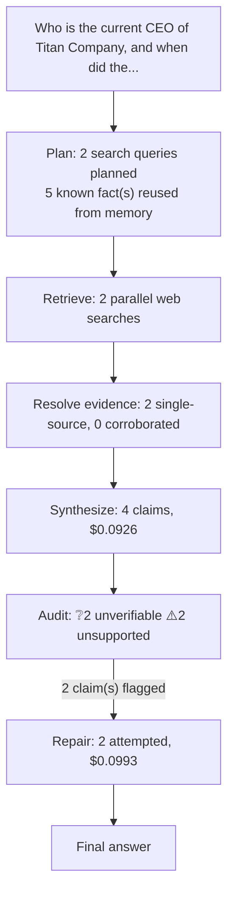

# q04: Who is the current CEO of Titan Company, and when did they take the role?

## Answer

Titan Company does not list a company-wide officer with the title “Chief Executive Officer”; its current Managing Director is Ajoy Chawla. Ajoy Chawla became Managing Director of Titan Company Limited on January 1, 2026, succeeding C. K. Venkataraman as Managing Director of Titan Company, effective January 1, 2026.

Original answer before repair

Titan Company does not list a company-wide officer with the title “Chief Executive Officer”; its current Managing Director is Ajoy Chawla. He took the role on January 1, 2026, succeeding C. K. Venkataraman.

## Evidence

| Verdict | Claim | Citation | Quote | Reasoning |
|---|---|---|---|---|
| ❔ unverifiable | Titan Company does not list a company-wide officer titled “Chief Executive Officer.” | [link](https://www.titancompany.in/leadership-team?utm_source=openai) | — | Cited page returned HTTP 200 but no extractable body text (commonly a JavaScript-rendered page whose content isn't in the server-sent HTML) -- could not verify against it. |
| ❔ unverifiable | Ajoy Chawla is Titan Company’s current Managing Director. | [link](https://www.titancompany.in/leadership-team?utm_source=openai) | — | Cited page returned HTTP 200 but no extractable body text (commonly a JavaScript-rendered page whose content isn't in the server-sent HTML) -- could not verify against it. |
| ⚠️ unsupported | Ajoy Chawla became Managing Director on January 1, 2026. | [link](https://www.titancompany.in/sites/default/files/2025-11/Q2FY26%2520Results.pdf?utm_source=openai) | — | The provided evidence chunks are corrupted or unreadable and contain no discernible statement about Ajoy Chawla, a Managing Director appointment, or January 1, 2026. |
| ⚠️ unsupported | Ajoy Chawla succeeded C. K. Venkataraman as Managing Director. | [link](https://www.titancompany.in/sites/default/files/2025-05/SE09Successionplan.pdf?utm_source=openai) | — | The provided evidence chunks are garbled or binary data and contain no readable statement about Ajoy Chawla, C. K. Venkataraman, or a Managing Director succession. Therefore, the claim is neither conf |

## Repair attempts

- **confirmed** (was `unsupported`): "Ajoy Chawla became Managing Director on January 1, 2026." -> "Ajoy Chawla became Managing Director of Titan Company Limited on January 1, 2026." ([source](https://www.titancompany.in/sites/default/files/2025-12/Postal%20Ballot%20notice%20Ajoy.pdf))
- **confirmed** (was `unsupported`): "Ajoy Chawla succeeded C. K. Venkataraman as Managing Director." -> "Ajoy Chawla succeeded C. K. Venkataraman as Managing Director of Titan Company, effective January 1, 2026." ([source](https://www.titancompany.in/sites/default/files/2025-05/SE09Successionplan.pdf))

## Cost

- Analyst: $0.0926
- Audit: $0.0018
- Repair: $0.0993
- **Total: $0.1936**
