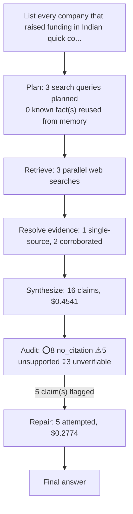

# q05: List every company that raised funding in Indian quick commerce since January 2026, with amounts, investors and dates.

## Answer

Based only on the supplied evidence, Dazzl raised $3.2 million from Stellaris and angels Ritesh Agarwal and Abhishek Bansal on January 13, 2026. Zilo raised $15.3 million from Peak XV Partners, Info Edge Ventures, Chiratae Ventures, Alteria Capital, Stride Ventures and named angels on February 5, 2026; HomeRun raised ₹60 crore (about $6.6 million) from Sorin Investments, Titan Capital, Sparrow, Consumer Collective and Helios on February 17. Inamo raised $8 million from Prime Venture Partners, Shastra VC, Antler India and Gemba Capital on March 2, 2026; Blinkit received ₹450 crore from parent Eternal on March 12; Swish raised $38 million from Hara Global, Bain Capital Ventures and Accel on March 23; Ozi raised $6.2 million from RTP Global, Blume, Huddle and Zerpact on March 25; and Pronto raised an initial $25 million, later extended to $45 million, from Epiq Capital, Lachy Groom and prior backers in March, although the exact day was not provided. BazaarNow raised ₹72 crore (about $7.5 million) from Peak XV Partners, Whiteboard Capital, Antler, Nirman Ventures, and named angel investors on June 9, 2026; it ultimately raised ₹72 crore (about $7.5 million) in a funding round, while an earlier report said it was in talks to raise $9 million. Plazza raised $15 million from Accel, Elevation, Nexus, All In and Better Capital on July 20; Fixxly raised $5.5 million from Accel, Fireside and Lightspeed India on July 29; HomeRun raised another $12 million from Nexus Venture Partners, Sorin Investments, Titan Capital, Sparrow Capital and Consumer Collective on August 6, 2026; and Peeko raised ₹67.4 crore, reported as over $7 million, from Chiratae, Stellaris and angels on August 20. Zepto’s reported July 17 $800 million IPO was excluded because it was not confirmed as completed, while the evidence’s reference to a $55 million FirstClub raise from Peak XV, Sofina and others lacks an announcement date and therefore cannot be verified against the requested period.

Original answer before repair

Based only on the supplied evidence, Dazzl raised $3.2 million from Stellaris and angels Ritesh Agarwal and Abhishek Bansal on January 13, 2026. Zilo raised $15.3 million from Peak XV Partners, Info Edge Ventures, Chiratae Ventures, Alteria Capital, Stride Ventures and named angels on February 5; HomeRun raised ₹60 crore (about $6.6 million) from Sorin Investments, Titan Capital, Sparrow, Consumer Collective and Helios on February 17. Inamo raised $8 million from Prime Venture Partners, Shastra VC, Antler India and Gemba Capital on March 2; Blinkit received ₹450 crore from parent Eternal on March 12; Swish raised $38 million from Hara Global, Bain Capital Ventures and Accel on March 23; Ozi raised $6.2 million from RTP Global, Blume, Huddle and Zerpact on March 25; and Pronto raised an initial $25 million, later extended to $45 million, from Epiq Capital, Lachy Groom and prior backers in March, although the exact day was not provided. BazaarNow raised ₹72 crore (about $7.5 million) from Peak XV Partners, Whiteboard Capital, Antler, Nirman Ventures and named angels around June 9–11; I preferred this finalized figure over the preliminary $9 million “in talks” headline because it is more specific to the completed event. Plazza raised $15 million from Accel, Elevation, Nexus, All In and Better Capital on July 20; Fixxly raised $5.5 million from Accel, Fireside and Lightspeed India on July 29; HomeRun raised another $12 million from Nexus Venture Partners, Sorin Investments, Titan Capital, Sparrow Capital and Consumer Collective on August 6; and Peeko raised ₹67.4 crore, reported as over $7 million, from Chiratae, Stellaris and angels on August 20. Zepto’s reported July 17 $800 million IPO was excluded because it was not confirmed as completed, while the evidence’s reference to a $55 million FirstClub raise from Peak XV, Sofina and others lacks an announcement date and therefore cannot be verified against the requested period.

## Evidence

| Verdict | Claim | Citation | Quote | Reasoning |
|---|---|---|---|---|
| ⭕ no_citation | Dazzl raised $3.2 million from Stellaris and angels including Ritesh Agarwal and Abhishek Bansal on January 13, 2026. | — | — | Claim carries no citation to verify against. |
| ⚠️ unsupported | Zilo raised $15.3 million from Peak XV Partners, Info Edge Ventures, Chiratae Ventures, Alteria Capital, Stride Ventures and named angels on February 5, 2026. | [link](https://economictimes.indiatimes.com/tech/funding/fashion-quick-commerce-startup-zilo-raises-15-3-million-led-by-peak-xv-partners/articleshow/127924933.cms?from=mdr&utm_source=openai) | Zilo, a fashion quick commerce startup founded by former Flipkart and Myntra executives, has raised $15.3 million in funding led by Peak XV Partners,  | The evidence supports the $15.3 million amount and Peak XV Partners’ lead role, and names InfoEdge Ventures, Chiratae Ventures, and some angel investors. However, it does not state the February 5, 202 |
| ⭕ no_citation | HomeRun raised ₹60 crore, approximately $6.6 million, from Sorin Investments, Titan Capital, Sparrow, Consumer Collective and Helios on February 17, 2026. | — | — | Claim carries no citation to verify against. |
| ⚠️ unsupported | Inamo raised $8 million from Prime Venture Partners, Shastra VC, Antler India and Gemba Capital on March 2, 2026. | [link](https://www.entrepreneur.com/en-in/news-and-trends/prime-venture-partners-leads-usd-8-mn-investment-in-inamo/503082?utm_source=openai) | A Mumbai-based quick commerce enablement startup, Inamo, has raised USD 8 million in a Series A funding round led by Prime Venture Partners, with part | The evidence confirms the USD 8 million raise and named investors, but none of the chunks mention March 2, 2026. Therefore, the full claim is not supported. |
| ❔ unverifiable | Blinkit received a ₹450 crore capital infusion from parent Eternal on March 12, 2026. | [link](https://www.moneycontrol.com/news/business/eternal-injects-rs-450-crore-into-blinkit-via-rights-issue-as-quick-commerce-battle-intensifies-13858303.html?utm_source=openai) | — | Could not fetch cited source: Client error '403 Forbidden' for url 'https://www.moneycontrol.com/news/business/eternal-injects-rs-450-crore-into-blinkit-via-rights-issue-as-quick-commerce-battle-inten |
| ⭕ no_citation | Swish raised $38 million from Hara Global, Bain Capital Ventures and Accel on March 23, 2026. | — | — | Claim carries no citation to verify against. |
| ❔ unverifiable | Ozi raised $6.2 million from RTP Global, Blume, Huddle and Zerpact on March 25, 2026. | [link](https://www.moneycontrol.com/news/business/funding/baby-care-quick-commerce-startups-ozi-raises-6-2-million-in-funding-from-rtp-global-13870561.html/amp?utm_source=openai) | — | Could not fetch cited source: Client error '403 Forbidden' for url 'https://www.moneycontrol.com/news/business/funding/baby-care-quick-commerce-startups-ozi-raises-6-2-million-in-funding-from-rtp-glob |
| ⭕ no_citation | Pronto raised an initial $25 million, later extended to $45 million, from Epiq Capital, Lachy Groom and prior backers in March 2026; the exact announcement day was not supplied. | — | — | Claim carries no citation to verify against. |
| ⚠️ unsupported | BazaarNow raised ₹72 crore, approximately $7.5 million, from Peak XV Partners, Whiteboard Capital, Antler, Nirman Ventures and named angels around June 9–11, 2026. | [link](https://inc42.com/buzz/exclusive-quick-commerce-startup-bazaarnow-in-talks-to-raise-9-mn/?utm_source=openai) | Quick commerce startup BazaarNow has raised ₹72 Cr (about $7.5 Mn) in a funding round led by Peak XV Partners, with participation from Whiteboard Capi | The evidence supports the ₹72 crore/$7.5 million amount and names Peak XV Partners, Whiteboard Capital, and Antler. However, it does not mention Nirman Ventures, named angels, or the June 9–11, 2026 t |
| ⚠️ unsupported | For BazaarNow, the finalized ₹72 crore figure in the supplied evidence was preferred over the preliminary $9 million “in talks” headline because it was more specific to the completed event. | [link](https://inc42.com/buzz/exclusive-quick-commerce-startup-bazaarnow-in-talks-to-raise-9-mn/?utm_source=openai) | Quick commerce startup BazaarNow has raised ₹72 Cr (about $7.5 Mn) in a funding round led by Peak XV Partners, with participation from Whiteboard Capi | The evidence reports both a ₹72 crore raised figure and an earlier $9 million figure described as being in talks, but it does not state that the former was preferred because it reflected a completed e |
| ⭕ no_citation | Plazza raised $15 million from Accel, Elevation, Nexus, All In and Better Capital on July 20, 2026. | — | — | Claim carries no citation to verify against. |
| ⭕ no_citation | Fixxly raised $5.5 million from Accel, Fireside and Lightspeed India on July 29, 2026. | — | — | Claim carries no citation to verify against. |
| ⚠️ unsupported | HomeRun raised another $12 million from Nexus Venture Partners, Sorin Investments, Titan Capital, Sparrow Capital and Consumer Collective on August 6, 2026. | [link](https://economictimes.indiatimes.com/tech/funding/construction-qcomm-outfit-homerun-raises-12-million-from-nexus-venture-partners-others/articleshow/132984906.cms?UTM_Campaign=RSS_Feed&UTM_Medium=Referral&UTM_Source=Google_Newsstand&utm_source=openai) | HomeRun, a quick commerce platform for construction and interior materials, has raised $12 million in a funding round led by Nexus Venture Partners, w | The evidence supports the $12 million raise and names the listed investors, and it mentions a prior $6.6 million raise. However, none of the chunks states that the funding occurred on August 6, 2026,  |
| ⭕ no_citation | Peeko raised ₹67.4 crore, reported as over $7 million, from Chiratae, Stellaris and angels on August 20, 2026. | — | — | Claim carries no citation to verify against. |
| ❔ unverifiable | Zepto's reported $800 million IPO on July 17, 2026 was not confirmed as a completed funding event. | [link](https://www.moneycontrol.com/news/business/ipo/zepto-ipo-norges-motilal-oswal-to-invest-in-800-million-ipo-valuing-company-at-5-1-billion-post-money-13976803.html?utm_source=openai) | — | Could not fetch cited source: Client error '403 Forbidden' for url 'https://www.moneycontrol.com/news/business/ipo/zepto-ipo-norges-motilal-oswal-to-invest-in-800-million-ipo-valuing-company-at-5-1-bi |
| ⭕ no_citation | The supplied evidence references a $55 million FirstClub raise from Peak XV, Sofina and others but provides no announcement date. | — | — | Claim carries no citation to verify against. |

## Repair attempts

- **confirmed** (was `unsupported`): "Zilo raised $15.3 million from Peak XV Partners, Info Edge Ventures, Chiratae Ventures, Alteria Capital, Stride Ventures and named angels on February 5, 2026." -> "Zilo raised $15.3 million from Peak XV Partners, Info Edge Ventures, Chiratae Ventures, Alteria Capital, Stride Ventures and named angels on February 5, 2026." ([source](https://retail.economictimes.indiatimes.com/amp/news/e-commerce/e-tailing/fashion-quick-commerce-startup-zilo-raises-15-3-million-in-series-a-led-by-peak-xv/127925685))
- **confirmed** (was `unsupported`): "Inamo raised $8 million from Prime Venture Partners, Shastra VC, Antler India and Gemba Capital on March 2, 2026." -> "Inamo raised $8 million from Prime Venture Partners, Shastra VC, Antler India and Gemba Capital on March 2, 2026." ([source](https://www.entrepreneur.com/en-in/news-and-trends/prime-venture-partners-leads-usd-8-mn-investment-in-inamo/503082))
- **confirmed** (was `unsupported`): "BazaarNow raised ₹72 crore, approximately $7.5 million, from Peak XV Partners, Whiteboard Capital, Antler, Nirman Ventures and named angels around June 9–11, 2026." -> "BazaarNow raised ₹72 crore (about $7.5 million) from Peak XV Partners, Whiteboard Capital, Antler, Nirman Ventures, and named angel investors on June 9, 2026." ([source](https://www.cbinsights.com/company/bazaarnow/financials))
- **corrected** (was `unsupported`): "For BazaarNow, the finalized ₹72 crore figure in the supplied evidence was preferred over the preliminary $9 million “in talks” headline because it was more specific to the completed event." -> "BazaarNow ultimately raised ₹72 crore (about $7.5 million) in a funding round; an earlier report said it was in talks to raise $9 million." ([source](https://inc42.com/buzz/exclusive-quick-commerce-startup-bazaarnow-in-talks-to-raise-9-mn/))
- **confirmed** (was `unsupported`): "HomeRun raised another $12 million from Nexus Venture Partners, Sorin Investments, Titan Capital, Sparrow Capital and Consumer Collective on August 6, 2026." -> "HomeRun raised another $12 million from Nexus Venture Partners, Sorin Investments, Titan Capital, Sparrow Capital and Consumer Collective on August 6, 2026." ([source](https://inc42.com/buzz/exclusive-homerun-in-talks-to-raise-%E2%82%B9100-cr-to-scale-its-quick-construction-delivery-platform/))

## Cost

- Analyst: $0.4541
- Audit: $0.0021
- Repair: $0.2774
- **Total: $0.7335**
