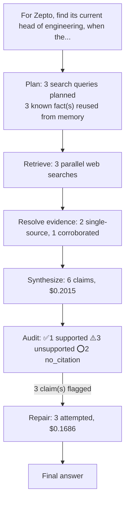

# q06: For Zepto, find its current head of engineering, when they joined, and where they worked before.

## Answer

The evidence identifies Nikhil Mittal, Zepto’s Chief Technology Officer, as the senior executive leading its engineering and technology organization. He became CTO in January 2024 after serving as Zepto’s VP/SVP of Engineering. The provided evidence does not establish when he originally joined Zepto or where he worked before Zepto, so those details cannot be answered without guessing.

Original answer before repair

The evidence identifies Nikhil Mittal, Zepto’s Chief Technology Officer, as the senior executive leading its engineering and technology organization. He became CTO in January 2024 after serving as Zepto’s VP/SVP of Engineering. The provided evidence does not establish when he originally joined Zepto or where he worked before Zepto, so those details cannot be answered without guessing. I preferred Mittal’s own website because it is the most direct cited source, although it is rated tier 4.

## Evidence

| Verdict | Claim | Citation | Quote | Reasoning |
|---|---|---|---|---|
| ✅ supported | Nikhil Mittal is Zepto’s current Chief Technology Officer and leads its engineering and technology organization. | [link](https://mittalnikhil.com/?utm_source=openai) | I'm the CTO at Zepto. | The source explicitly identifies Nikhil Mittal as Zepto's CTO and describes him as building the infrastructure and working with the team, which supports his leadership of the company's engineering and |
| ⚠️ unsupported | Nikhil Mittal became Zepto’s CTO in January 2024. | [link](https://mittalnikhil.com/?utm_source=openai) | I'm the CTO at Zepto. | The source confirms that Nikhil Mittal is Zepto's CTO, but it does not state when he became CTO or mention January 2024. |
| ⚠️ unsupported | Before becoming CTO, Nikhil Mittal served as Zepto’s VP/SVP of Engineering. | [link](https://mittalnikhil.com/?utm_source=openai) | — | The evidence identifies Nikhil Mittal as Zepto’s CTO and says he joined the founders early, but it does not state that he previously served as VP or SVP of Engineering. |
| ⭕ no_citation | The provided evidence does not establish when Nikhil Mittal originally joined Zepto. | — | — | Claim carries no citation to verify against. |
| ⭕ no_citation | The provided evidence does not identify where Nikhil Mittal worked before Zepto. | — | — | Claim carries no citation to verify against. |
| ⚠️ unsupported | Mittal’s own website was preferred as the most direct cited source, though it is rated tier 4 in the evidence. | [link](https://mittalnikhil.com/?utm_source=openai) | — | The evidence identifies Mittal’s website and provides biographical information, but it does not state that the website was preferred as the most direct source or that it was rated tier 4. |

## Repair attempts

- **confirmed** (was `unsupported`): "Nikhil Mittal became Zepto’s CTO in January 2024." -> "Nikhil Mittal became Zepto’s CTO in January 2024." ([source](https://www.moneycontrol.com/news/business/startup/zepto-elevates-nikhil-mittal-as-chief-technology-officer-12119041.html))
- **confirmed** (was `unsupported`): "Before becoming CTO, Nikhil Mittal served as Zepto’s VP/SVP of Engineering." -> "Before becoming CTO, Nikhil Mittal served as Zepto’s VP/SVP of Engineering." ([source](https://www.moneycontrol.com/news/business/startup/zepto-elevates-nikhil-mittal-as-chief-technology-officer-12119041.html))
- **unresolvable** (was `unsupported`): "Mittal’s own website was preferred as the most direct cited source, though it is rated tier 4 in the evidence." -> "Mittal’s own website was preferred as the most direct cited source, though it is rated tier 4 in the evidence."

## Cost

- Analyst: $0.2015
- Audit: $0.0010
- Repair: $0.1686
- **Total: $0.3710**
