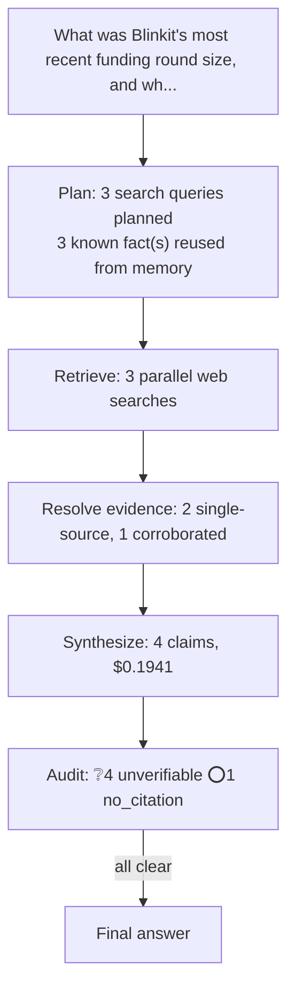

# q07: What was Blinkit's most recent funding round size, and who led it?

## Answer

Blinkit’s most recent reported funding was a ₹450 crore capital infusion through a rights issue, provided by its parent, Eternal Ltd. Because this was an intra-group infusion rather than a conventional third-party funding round, Eternal is the closest equivalent to the lead investor; I preferred Moneycontrol’s reporting because it is the higher-trust established-news source and specifically identifies the amount, investor, and transaction structure.

## Evidence

| Verdict | Claim | Citation | Quote | Reasoning |
|---|---|---|---|---|
| ❔ unverifiable | Blinkit’s most recent reported funding was a ₹450 crore capital infusion. | [link](https://www.moneycontrol.com/news/business/eternal-injects-rs-450-crore-into-blinkit-via-rights-issue-as-quick-commerce-battle-intensifies-13858303.html?utm_source=openai) | — | Could not fetch cited source: Client error '403 Forbidden' for url 'https://www.moneycontrol.com/news/business/eternal-injects-rs-450-crore-into-blinkit-via-rights-issue-as-quick-commerce-battle-inten |
| ❔ unverifiable | The capital infusion was structured as a rights issue. | [link](https://www.moneycontrol.com/news/business/eternal-injects-rs-450-crore-into-blinkit-via-rights-issue-as-quick-commerce-battle-intensifies-13858303.html?utm_source=openai) | — | Could not fetch cited source: Client error '403 Forbidden' for url 'https://www.moneycontrol.com/news/business/eternal-injects-rs-450-crore-into-blinkit-via-rights-issue-as-quick-commerce-battle-inten |
| ❔ unverifiable | Eternal Ltd., Blinkit’s parent, provided the funding and is the closest equivalent to the lead investor. | [link](https://www.moneycontrol.com/news/business/eternal-injects-rs-450-crore-into-blinkit-via-rights-issue-as-quick-commerce-battle-intensifies-13858303.html?utm_source=openai) | — | Could not fetch cited source: Client error '403 Forbidden' for url 'https://www.moneycontrol.com/news/business/eternal-injects-rs-450-crore-into-blinkit-via-rights-issue-as-quick-commerce-battle-inten |
| ❔ unverifiable | The transaction was an intra-group infusion rather than a conventional third-party funding round. | [link](https://www.moneycontrol.com/news/business/eternal-injects-rs-450-crore-into-blinkit-via-rights-issue-as-quick-commerce-battle-intensifies-13858303.html?utm_source=openai) | — | Could not fetch cited source: Client error '403 Forbidden' for url 'https://www.moneycontrol.com/news/business/eternal-injects-rs-450-crore-into-blinkit-via-rights-issue-as-quick-commerce-battle-inten |
| ⭕ no_citation | Moneycontrol is a higher-trust established-news source. | — | — | Claim carries no citation to verify against. |

## Cost

- Analyst: $0.1941
- Audit: $0.0000
- **Total: $0.1941**
