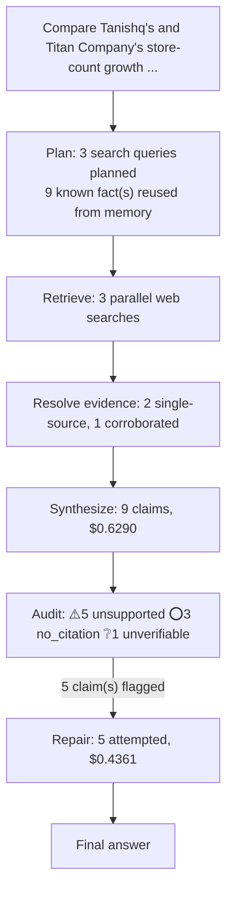

# q08: Compare Tanishq's and Titan Company's store-count growth over the last two years -- which grew faster, and does Titan's overall retail footprint include brands beyond Tanishq?

## Answer

Using Titan’s official, recent disclosures, Tanishq had 479 stores in FY2023-24 and 557 stores at the end of FY2025-26, an increase of 78 stores or about 16.3%. Titan’s overall retail network had 3,035 outlets in FY2023-24 and 3,603 outlets in FY2025-26, an increase of 568 or about 18.7%, so Titan grew faster in both absolute and percentage terms. Titan’s footprint extends beyond Tanishq and includes brands such as Mia, Zoya, CaratLane, Titan World, Helios and Titan Eye+; Titan’s FY2025-26 overall network total includes Damas.

Original answer before repair

Using Titan’s official, recent disclosures, Tanishq’s network grew from 479 stores in FY2023-24 to 557 in FY2025-26, an increase of 78 stores or about 16.3%. Titan’s overall network rose from 3,035 to 3,603 outlets over the same period, an increase of 568 or about 18.7%, so Titan grew faster in both absolute and percentage terms. Titan’s footprint extends beyond Tanishq and includes brands such as Mia, Zoya, CaratLane, Titan World, Helios and Titan Eye+; the FY2025-26 total also includes Damas.

## Evidence

| Verdict | Claim | Citation | Quote | Reasoning |
|---|---|---|---|---|
| ⚠️ unsupported | Tanishq had 479 stores in FY2023-24. | [link](https://www.titancompany.in/sites/default/files/2025-05/Q4FY25%20-%20Earnings%20presentation%20Uploaded_0.pdf) | — | The provided evidence chunks are garbled and do not state Tanishq's store count for FY2023-24. They neither confirm the figure of 479 nor provide a conflicting number. |
| ⚠️ unsupported | Tanishq had 557 stores in FY2025-26. | [link](https://www.titancompany.in/sites/default/files/2026-05/Q4FY26%20Earnings%20Presentation%20-%20Uploaded.pdf) | — | The evidence chunks consist of image/resource references and corrupted or unreadable text. They do not state that Tanishq had 557 stores in FY2025-26, nor do they provide a conflicting store count. |
| ⭕ no_citation | Tanishq added 78 stores, representing growth of about 16.3%, from FY2023-24 to FY2025-26. | — | — | Claim carries no citation to verify against. |
| ⚠️ unsupported | Titan’s overall retail network had 3,035 outlets in FY2023-24. | [link](https://www.titancompany.in/sites/default/files/2025-05/Q4FY25%20-%20Earnings%20presentation%20Uploaded_0.pdf) | — | The evidence chunks are corrupted or unintelligible and do not state Titan’s retail outlet count for FY2023-24. They neither confirm nor contradict the figure of 3,035 outlets. |
| ⚠️ unsupported | Titan’s overall retail network had 3,603 outlets in FY2025-26. | [link](https://www.titancompany.in/sites/default/files/2026-05/Q4FY26%20Earnings%20Presentation%20-%20Uploaded.pdf) | — | The evidence chunks consist mainly of image references and unreadable binary data. They do not state that Titan had 3,603 outlets in FY2025-26, nor do they provide a conflicting figure. |
| ⭕ no_citation | Titan’s overall network added 568 outlets, representing growth of about 18.7%, from FY2023-24 to FY2025-26. | — | — | Claim carries no citation to verify against. |
| ⭕ no_citation | Titan’s overall store count grew faster than Tanishq’s in both absolute and percentage terms over the period. | — | — | Claim carries no citation to verify against. |
| ❔ unverifiable | Titan’s retail footprint includes Mia, Zoya, CaratLane, Titan World, Helios and Titan Eye+ in addition to Tanishq. | [link](https://www.titancompany.in/our-brands) | — | Cited page returned HTTP 200 but no extractable body text (commonly a JavaScript-rendered page whose content isn't in the server-sent HTML) -- could not verify against it. |
| ⚠️ unsupported | Titan’s FY2025-26 overall network total includes Damas. | [link](https://www.titancompany.in/sites/default/files/2026-04/Titan%20-%20Q4FY26-%20Quarterly%20Update.pdf) | — | The evidence chunks are unreadable binary or compressed data and do not state whether Titan’s FY2025-26 overall network total includes Damas. They neither confirm nor contradict the claim. |

## Repair attempts

- **confirmed** (was `unsupported`): "Tanishq had 479 stores in FY2023-24." -> "Tanishq had 479 stores in FY2023-24." ([source](https://www.titancompany.in/sites/default/files/2024-05/Q4FY24%20Earnings%20Presentation.pdf))
- **confirmed** (was `unsupported`): "Tanishq had 557 stores in FY2025-26." -> "Tanishq had 557 stores at the end of FY2025-26." ([source](https://www.titancompany.in/sites/default/files/2026-09/Titan%20AR%202026_0.pdf))
- **confirmed** (was `unsupported`): "Titan’s overall retail network had 3,035 outlets in FY2023-24." -> "Titan’s overall retail network had 3,035 outlets in FY2023-24." ([source](https://titancompany.in/sites/default/files/2024-05/Q4FY24%20Earnings%20Presentation.pdf))
- **confirmed** (was `unsupported`): "Titan’s overall retail network had 3,603 outlets in FY2025-26." -> "Titan’s overall retail network had 3,603 outlets in FY2025-26." ([source](https://www.titancompany.in/sites/default/files/2026-04/Q4update202526.pdf))
- **confirmed** (was `unsupported`): "Titan’s FY2025-26 overall network total includes Damas." -> "Titan’s FY2025-26 overall network total includes Damas." ([source](https://www.titancompany.in/sites/default/files/2026-04/Q4update202526%20%281%29.pdf))

## Cost

- Analyst: $0.6290
- Audit: $0.0028
- Repair: $0.4361
- **Total: $1.0679**
